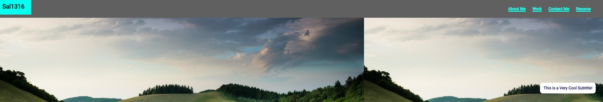
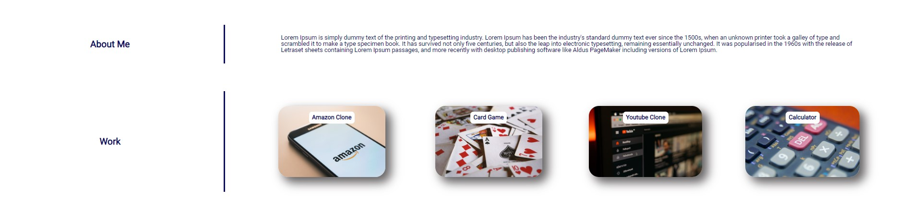

# SALVADOR'S PORTFOLIO

## Description

- This page is meant to provide infomation to a prospective employeer. In the page, you will find current and past rojects that I have completed in my journey to becoming a Developer.
- There projects were made to showcase the skills ranging from HTML, CSS, and JavaScript.
- Upon completing these projects, I was able to attain the neccessary knowledge to loop for an entry-level Developer position.

## GitHub repository link

      https://github.com/Sal1316/module-2-challenge.git

## GitHub published link:

      https://sal1316.github.io/module-2-challenge/

## Picture of page:

